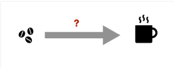

# Assignment 1

> Branden Walter
>
> V00820364
>
> May 18, 2023
>
> CSC 320

# Question 1

> In class, we discussed an informal state diagram describing the operation of an automatic door.
>
> You are to come up with a simple **informal state diagram** that describes the process of making drip coffee with an electric coffee maker.
>
> 
>
> The states of your state diagram should describe the progress/regress/status of the coffee making process. The actions of the coffee maker can be described as symbols of alphabet Σ={*C*,*F*,*M*,*P*,*W*}, where the symbols stand for the following actions/inputs.
>
> C: insert coffee 
>
> F: insert filter 
>
> M: place mug 
>
> P: turn on power 
>
> W: add water
>
> Note that the user can only turn on the power of the coffee maker, once everything is inserted/placed appropriately. Your state diagram should accept if the appropriate actions were taken, and should not accept otherwise.
>
> Carefully describe the meaning of each state of your state diagram in terms of the coffee making progress. Clearly identify start and accept state(s).

## Answer

# Question 2

> $$
> Let $\Sigma=\{0,1\}$. Consider the following languages $L_A$ and $L_B$ over $\Sigma$.
> 
> $L_A=\{w \in \Sigma^* | w$ contains $r$ occurrences of symbol 1, where $r>0$ and $r$ is divisible by 3 $\}$.
> 
> $L_B=\{w \in \Sigma^* | w$ represents a binary string that, interpreted as a binary number, is divisible by 5 $\}$.
> 
> For each of the following strings, decide:
> 
> \begin{enumerate}
> \item Is it a member of $L_A$?
> \item Is it a member of $L_B$?
> \end{enumerate}
> 
> \begin{enumerate}[label=(\roman*)]
> \item 011001
> \item 0010111
> \item 110111
> \item 0
> \end{enumerate}
> 
> \begin{enumerate}[resume]
> \item Is $\epsilon \in L_A \cap L_B$? If your answer is yes: why? If your answer is no: why not?
> \end{enumerate}
> $$
>
> 

## Answer

# Question 3

> 

# Question 4

> 

# Question 5

>