# (CSC 320) Foundations of Computer Science - Complete Notes - Summer 2023

[TOC]

- [Course Intro (syllabus)](#course-intro--syllabus-)
  * [Topics](#topics)
  * [Outcomes](#outcomes)
  * [Grading and due dates](#grading-and-due-dates)
    + [Quizzes](#quizzes)
    + [Assignments](#assignments)
    + [Midterms // Exams](#midterms----exams)
  * [Handling of late Quizzes and Assignments](#handling-of-late-quizzes-and-assignments)

# Course Intro (syllabus)

> Professor Name: Ulrike Stege
>
> Email: ustege@uvic.ca
>
> Office: ECS 624
>
> Office hours:
>
> - Monday 3:30pm - 4:30pm
> - Thursday 2:30pm - 3:30pm 
>
> Tutorials start May 8th 

## Topics 

- Formal definitions of computation, languages and computability
- Models of Computation: finite state automata, pushdown automata, grammars and Turing machines; deterministic and non-deterministic machines
- The Halting Problem, reductions, and NP-completeness
- Dealing with intractability (if time permits)

## Outcomes

- understand and analyze when it is possible to solve a problem computationally
- understand and prove when a problem is undecidable
- understand and illustrate how limitations on computational resources limit the class of problems that can be solved
- understand and apply models of computation for different problems in the Chomsky hierarchy
- characterize and analyze computational problems that are tractable
- characterize and prove computational problems that are intractable
- characterize the class of problems solvable in a model
- understand what it means for models of computation to be equivalent
- understand and apply reductions to prove intractability and undecidability of problems
- transform an automaton into a different equivalent representation, and vice versa

## Grading and due dates

### Quizzes

| **Quiz** | **Due date** | **Weight** |
| -------- | ------------ | ---------- |
| Quiz 1   | May 12       | 1%         |
| Quiz 2   | May 19       | 1%         |
| Quiz 3   | May 26       | 1%         |
| Quiz 4   | Jun 02       | 1%         |
| Quiz 5   | Jun 09       | 1%         |
| Quiz 6   | Jun 23       | 1%         |
| Quiz 7   | Jun 30       | 1%         |
| Quiz 8   | Jul 07       | 1%         |
| Quiz 9   | Jul 21       | 2%         |

### Assignments

| **Assignment** | **Assigned on** | **Due Date** | **Weight** |
| -------------- | --------------- | ------------ | ---------- |
| Assignment 1   | May 15          | May 20       | 5%         |
| Assignment 2   | May 25          | May 30       | 5%         |
| Assignment 3   | Jun 22          | Jun 27       | 5%         |
| Assignment 4   | Jun 29          | Jul 05       | 5%         |
| Assignment 5   | Jul 20          | Jul 25       | 5%         |

### Midterms // Exams

| **Exam**   | **Date** | **Duration** | **Weight** |
| ---------- | -------- | ------------ | ---------- |
| Midterm 1  | Jun 12   | 50 min       | 10%        |
| Midterm 2  | Jul 10   | 50 min       | 15%        |
| Final Exam | TBA      | 3 hours      | 40%        |

## Handling of late Quizzes and Assignments

To accommodate for potential difficulties keeping deadlines such as illness, note below. Note that **no other accommodations** will be made.

> <u>**Quizzes**</u>
>
> There are 9 **timed** quizzes. Each quiz is available throughout a 24-hour window. Once you start the quiz, you will need to complete it in the given time window.
>
> For quizzes 1 to 8, every student can miss at most one quiz. The weight of the missed quiz will be distributed evenly over the remaining quizzes. For other missed quizzes a grade of 0 will be assigned.

> <u>**Assignments**</u>
>
> There are 5 assignments.
>
> A late penalty of 3% is imposed for every hour of handing in an assignment late. For assignments 1 to 4, every student can miss at most one assignment. The weight of the missed assignment will be distributed evenly over the remaining assignments. For other missed assignments, a grade of 0 will be assigned.

> <u>**Midterms**</u>
>
> There are 2 midterms. Everyone can miss up to one midterm. The weight of the missed midterm will be added onto the weight of the final exam. For another missed midterm, a grade of 0 will be assigned.

## Lectures & Tutorials

- **Lectures** are taught in-person
- Each lecture will be streamed via zoom
- Lectures are recorded and posted
- I **strongly recommend** to attend every lecture live (in-person or online)
-  **Tutorials** are taught **online**
- Tutorials are not recorded
- I s**trongly recommend** to attend the weekly tutorials (starting week of May 08)

> If you are worried, feel unwell or have symptoms, participate online. We are working hard on providing a good hybrid experience for you.

## Operation & Team

- Course on Brightspace; assessment on Crowdmark
- Regularly check Brightspace & Crowdmark for reading materials, lecture slides, deadlines, assessments
- Instructor: Dr. Ulrike Stege
- TAs: 
  - Sajed Karimy
  - Ivan Perez Martell
  - Luke Trinity
  - Stella Zarei

## Office hours—in-person or online

> First Office Hours: May 8

- Instructor’s office hours (times: subject to change) 
- Zoom link on Brightspace (same as for lecture)
  - Mondays: 2:30pm—3:30pm 
  - Thursday: 3:30pm—4:30pm
- ECS 624

## Pre-requisites for CSC 320— Foundations of Computer Science

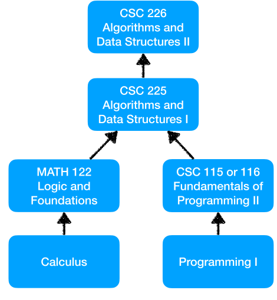

## Foundations of Computer Science: Why this course?

- What can we do with (classical) computers?
- What are the limitations of (classical) computing?

## Foundations of Computer Science: Why this course?

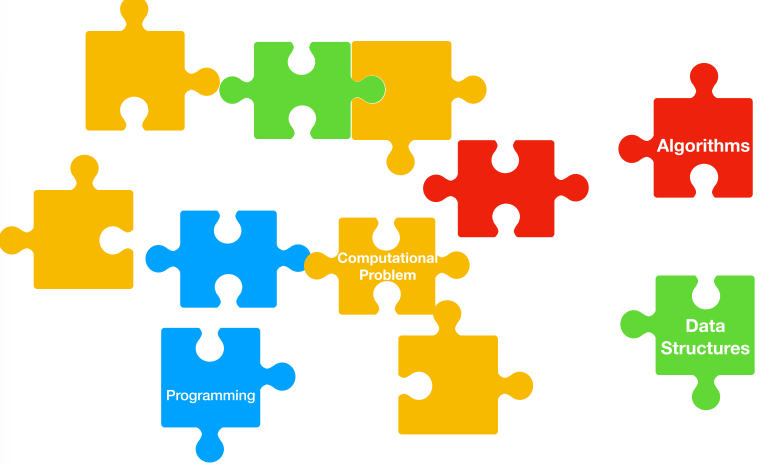

## Foundations of Computer Science—What’s that?

- Study **fundamental nature** of (classical) **computation**
- What **problems** are **solvable** using a (classical) **computer**?
- We **need to know** answers to
  - What exactly is a **problem**? 
  - What exactly is a **solution to a problem?** 
  - How do we **model** a **computer**?

> Note: 
>
> In our context, solving a problem means: 
>
> - answer the question posed in the problem exactly/ perfectly

## Remaining Outline for today’s lecture

- Expected Course and Learning Outcomes
- Administrative announcements 
- Academic Integrity
- Some basics and background

## CSC 320 Learning Outcomes

- An understanding of the following:
  - What are the fundamental capabilities and limitations of computers?
  -  What makes some problems computationally hard and others easy?
- Topics discussed are in the following areas: (Computational models from three perspectives)
  - Automata theory
  - Computability theory
  - Complexity theory

> CSC 225, 226: Theory of **algorithms**

## Automata Theory: Examples of Automata

- Finite automata
  - Used in text processing, compilers, hardware design, appliances, …
- Pushdown automata (or context-free grammars)
  - Used in programming languages, artificial intelligence
- Turing machines
  - Model of our “conventional” computer

## Some Terminology

> **Unsolvable** or **undecidable**
>
> problems not solvable using our (standard/classical) computing model (independent of resource limitations)

> **Easy** **to solve**
>
> problems solvable in polynomial time (using our standard/classical computing model)

> **Hard to solve:**
>
> problems solvable (in theory, using our standard computing model) but (likely) not solvable in polynomial time (using our standard/classical computing model)

## After completion of the course: You will be able to answer questions such as:

- Are there any problems that—no matter how powerful the computer/no matter how much time you have—your computer would not not be able to solve?
- Is it decidable (ie., is there a computation that allows us to decide), in **Conway's Game of Life**, whether given an initial pattern and another pattern, the latter pattern can ever appear when starting from the initial one?

## Conway’s Game of Life

- Example of a cellular automaton
- Played on an infinite two-dimensional rectangular grid of cells
- Each cell can be either alive or dead
- Status of each cell c changes each turn of the game (generation) depending on the statuses of c's (eight) neighbors: cells that touch c, either horizontal, vertical, or diagonal from that cell
- Initial pattern: first generation
- Next generation: evolves from applying given rules simultaneously to every cell on the game board 
  - If the cell is alive, then it stays alive if it has either exactly 2 or exactly 3 live neighbors 
  - If the cell is dead, then it is “born” only if it has exactly 3 live neighbors

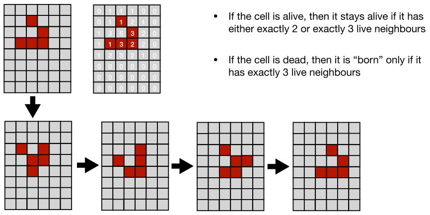

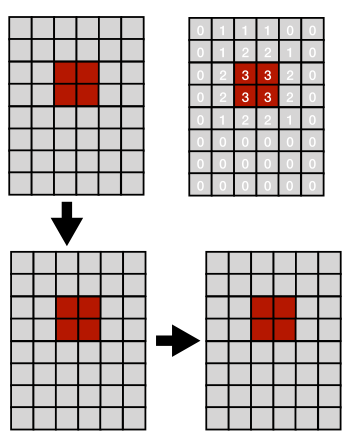

## After completion of the course: You will be able to answer questions such as

- Are there any problems that—no matter how powerful the computer/no matter how much time you have—your computer would not not be able to solve?
- Is it decidable (ie., is there a computation that allows us to decide), in **Conway's Game of Life**, whether given an initial pattern and another pattern, the latter pattern can ever appear when starting from the initial one?
- Is it decidable, given a finite set of tile types, to determine whether there is an arrangement of them with adjacent sides matching that tiles the plane? (**The Tiling Problem**)
- Is it possible to design an algorithm that is the perfect antivirus software, that is a software that decides for any current or future software whether or not the software can act like a virus?
- Is it possible to design a perfect debugger (an algorithm that that, among other bugs, catches infinite loops)?
- Is there an algorithm that schedules exams over a limited time period, such that no student is scheduled to take two or more exams at the same time?

> If the answer is yes to one or more such questions, we ask whether there exists an algorithm that is tractable, that is it returns the solution in an acceptable amount of time.

## Big (but unachievable) goals ….

- Universal debuggers
- Universal interpreters
- Universal malware detectors

## Course Topics

- Formal definitions of computations, languages and computability 
- Models of computation
  - Finite automata, pushdown automata, Turing machines
  - Grammars 
  - Deterministic and non-deterministic machines
- Undecidability, Decidability, Church-Turing Thesis 
  - The Halting problem 
  - Reductions
- Complexity theory
  - **P = NP?** NP-hardness, NP-completeness
  - Polynomial-time reductions
- If time permits: Dealing with NP-hardness; quantum computing

## Related Questions

- If at all: what type of problems can humans solve of the ones that are not solvable by (classical) computers?
- Can computers (eg: robots, conversational agents) act as humans?

## Turing Machines, Turing Test, Conversational Agents

- Turing test (developed by A. Turing,1950) 
- First conversational agent: ELIZA (J. Weizenbaum, 1966)
- Today: many conversational agents:
  - IBM Watson Jeopardy 
  - Siri 
  - Cortana
  - Alexa 
  - Google Assistant
  - Chatbots

## Where to find Information, Course Materials, Assessments

- Official Course Outline
- Brightspace
- Crowdmark

## Deadlines; Assessment

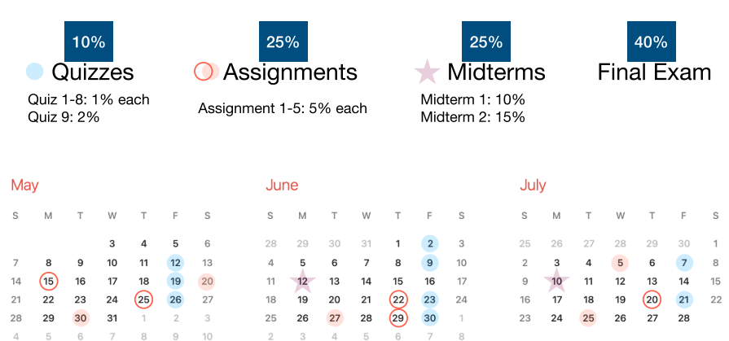

> Accommodation for potential difficulties keeping deadlines due to illness Note: No other accommodation will be made

### Quizzes

There are 9 timed quizzes. Each quiz is available throughout a 24-hour window. Once you start the quiz, you will need to complete it in the given time window.
For quizzes 1 to 8, every student can miss at most one quiz. The weight of the missed quiz will be distributed evenly over the remaining quizzes. For other missed quizzes a grade of 0 will be assigned.

### Assignments

There are 5 assignments.
A late penalty of 3% is imposed for every hour of handing in an assignment late. For assignments 1 to 4, every student can miss at most one assignment. The weight of the missed assignment will be distributed evenly over the remaining assignments. For other missed assignments, a grade of 0 will be assigned.

### Midterms

There are 2 midterms. Everyone can miss at most one midterm. The weight of the missed midterm will be added onto the weight of the final exam. For another missed midterm, a grade of 0 will be assigned.

## Textbook, Prerequisites

- Book: Introduction to the Theory of Computation by M. Sipser

## Questions about the course, assignments, content, …?

- Consult in the following order 
  - Course outline/Brightspace/Lecture Notes 
  - Instructor in office hours or TA in tutorials 
  - If unresolved: email (ustege@uvic.ca) 
    - Always: CSC 320 in subject line
    - Use your UVic preferred email

## Questions about marking

### Grade change requests

- Within one week of grades posted
- In my office hours or email to me (ustege@uvic.ca)
- Specific question/argument why your answer is correct/deserves your mark
- Present your knowledge

## Today’s Theory of (Classical) Computation …

- is based on the Church-Turing Thesis

> Fall 2018
>
> Any real-world computation can be translated into an equivalent computation involving a Turing machine

- resource constraints (time, space) are ignored
- **Turing** **machine**: abstract model of (classical) computer

> Today
>
> Does Quantum Computing add computational power?

## Assuming that any problem that can be computed can be translated into a Turing machine computation …

- then there must be a Turing machine computation for every problem that we can compute
- What if there are **more problems** that we would like to compute **than** there are **Turing machine computations?**
- Then, there would be **problems** that are **not computable** by a Turing machine

> We will learn that problems exist that are not computable/decidable by a Turing machine (eg: Halting problem)

## Countable and uncountable

- A set is **countable** if it is **finite** or **countably infinite**: the elements of a countable set can always be counted one at a time; every element of the set is associated with a unique natural number
- There exists a **bijection** between any **countably infinite** set and the **set of natural numbers** ℕ
- There exists a **bijection** between any **finite set** and a **finite subset of** ℕ
- A set that is neither finite nor countably infinite is **uncountable**

## Let’s count some sets

- By definition N is countable

- Lets count the set of all integers Z
- How do we enumerate all elements in Z?

| N    | Z    |
| ---- | ---- |
| 0    | 0    |
| 1    | -1   |
| 2    | 1    |
| 3    | -2   |
| 4    | 2    |
| 5    | -3   |
| 6    | 3    |

- Let’s first list them

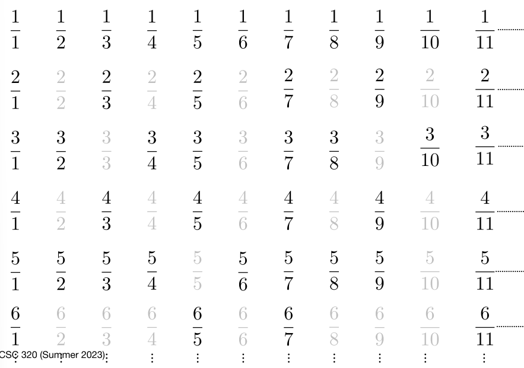

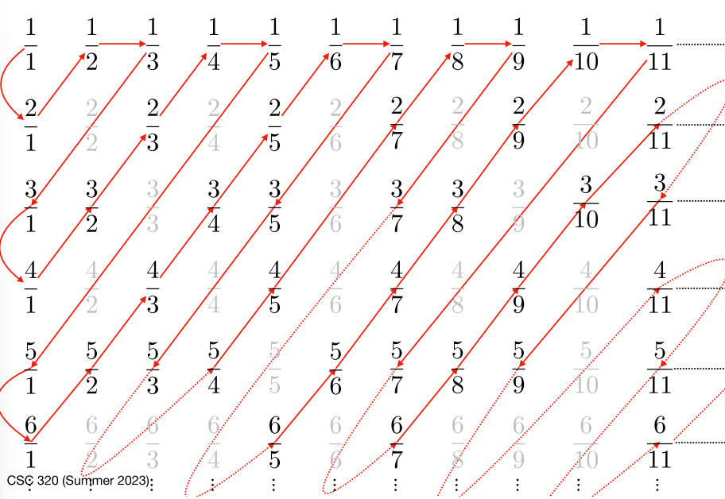

### Counting ℚ+∖{0}

- We found a way to enumerate all rational numbers without getting stuck in infinity
- Enumeration algorithm above defines bijection with ℕ

> Note: 
>
> Counting row by row (or alternatively column by column) would never reach all numbers—since we would never leave the first row (column)

### Cantor’s Diagonalization Argument

**Proof by contradiction:** Assume: R is countable. 

If is countable then we can enumerate, eg, the set of all real numbers between 0 and 1:

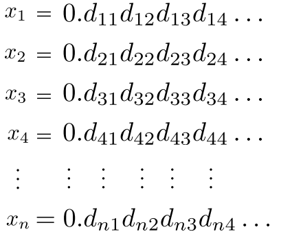

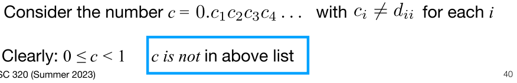

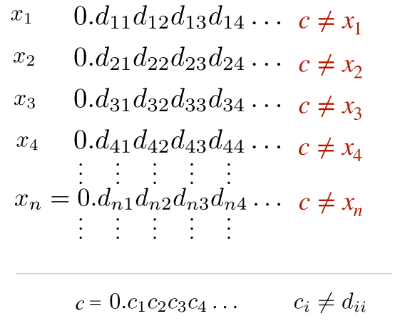

#### Conclusion

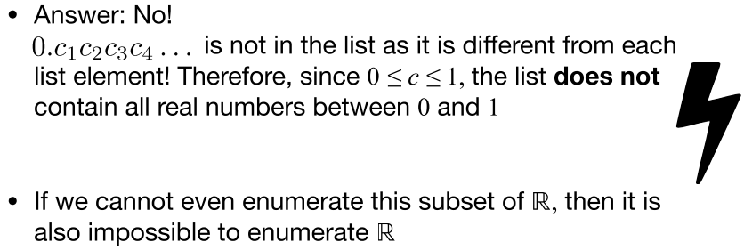

## Terminology Review: Sets

> **A Set**
> $$
> S = \{3, l, 20, \text{{green}}, \delta\}
> $$
>
> - Objects in a set: elements / Members

> **Membership / Non-Membership**
> $$
> \alpha \in S, \quad \beta \notin S
> $$

> **Empty Set**
> $$
> \emptyset
> $$

> **Singleton Set** 
>
> - Set with exactly one pair 

> **Unordered Pair**
>
> - Set with exactly two members

## Terminology Review: Set Operations

- Union of sets A and B: 

$$
A \cup B = \{x|x \in A \text{ or } x \in B\}
$$

- Intersection of sets A and B:

$$
A \cap B = \{x|x \in A \text{ and } x \in B\}
$$

- Complement of set A: $$

$$
A' = \{x|x \notin A\}
$$

- Set difference of sets A and B:

$$
A \setminus B = \{x \in A : x \notin B\}
$$

## More terminology: Powerset

- Powerset P(A) of set A: Set of all subsets of A

$$
P(A) = \{S|S \subseteq A\} \quad \text{Note that} \quad \emptyset \in P(A)
$$

## Alphabets, Languages, Strings, Symbols

Terminology to describe and work with finite automata and more:

- An **alphabet Σ** is a **finite** set of **symbols**
  - For example, the binary alphabet is {0,1} or the Roman/Latin alphabet
- A **string** over an alphabet Σ is a finite sequence of symbols from Σ
  - 0001 is a string over alphabet {0,1}
- The **empty string** ε is the string with no symbols

## Alphabets, Languages, Strings, Symbols (2)

- The set of all strings over an alphabet is denoted Σ*
- Note: ε ∈ Σ*, i.e., ε is a string over any alphabet
- Example: Let Σ = {a,b}. Then Σ* = {ε, a, b, aa, ab, ba, bb, aaa, aab, aba, abb, baa, bab, bba, bbb, …}

## Alphabets, Languages, Strings, Symbols (3)

- The length |w| of a string w ∈ Σ* is the number of symbols of w when considered as a sequence
- For example, length of the empty string ε: |ε| = 0
- For a string w = ab, |w| = 2
- For a string w ∈ Σ*, the symbol in the ith position of w is denoted wi. We say that wi occurs in position i of w
- Note that a symbol may occur more than once in the same string. For example, for w = aba, w2 = b.

## Alphabets, Languages, Strings, Symbols (4)

#### Operations and relations on strings

- Concatenation for strings x and y yields string xy
- Concatenation is an associative operation: xyz := (xy)z = x(yz)
- For example, for Σ = {a, b, c} , if x = ab, y = bac, and z = bba : xyz = abbacbba

## Alphabets, Languages, Strings, Symbols (5)

#### More operations and relations on strings

- String v is a substring of string w if and only if there are strings x and y such that w = xvy
- If y = ε then w = xv and v is a suffix of w
- If x = ε then w = vy and v is a prefix of w
- For example, if w = abbacbba then:
  - cbba is a suffix of w
  - abb is a prefix of w

------

## Alphabets, Languages, Strings, Symbols (6)

#### And more operations and relations on strings

- A string written backwards is denoted w^R and called the reversal of w
- For example, If w = abbacbba then w^R = abbcabba

## Didn’t we say we wanted to study problems and their solutions?

## Examples: Yes-No-Problems and their Languages

## Languages / Yes/No problems: How many are there?

## How large is Sigma*?

## How large is the set of all languages over Sigma?

## The Powerset of sigma star equals ?

## Powerset of the Natural Numbers is uncountable

## How large is the set of all languages?

## So far

## Next up: Finite Automata and Regular languages

## Automata Theory

## Finite Automata & Regular Languages

## Finite Automata

## Finite Automata in Practice

## Other Applications of Finite Automata

## Abstract Description of the Finite Automaton

## State Diagram

## Formal Definition of Deterministic Finite Automaton

# Major Topics (Midterm 1 Study Review)

## Countable vs  Uncountable

## Deterministic Finite Automaton (DFA)

### DFA state minimization

## Non-deterministic Finite Automata (NFA)

### Equivalence of NFAs and DFAs

## Reductions

## Regular languages 

### Closure properties of regular languages

### Regular languages are closed under concatenation

## Non-regular languages

## Regular Expressions 

### The languages of regular expressions are exactly the regular languages

## Pumping Lemma

### PL for Regular Languages

### PL for Non-regular Languages 

## Context-free Languages and grammars

### Context-free grammars

#### Ambiguous grammars

### Context-free languages

#### Inherently ambiguous languages

### Pushdown Automata

### Chomsky Normal Form

### Pumping Lemma for context-free languages
